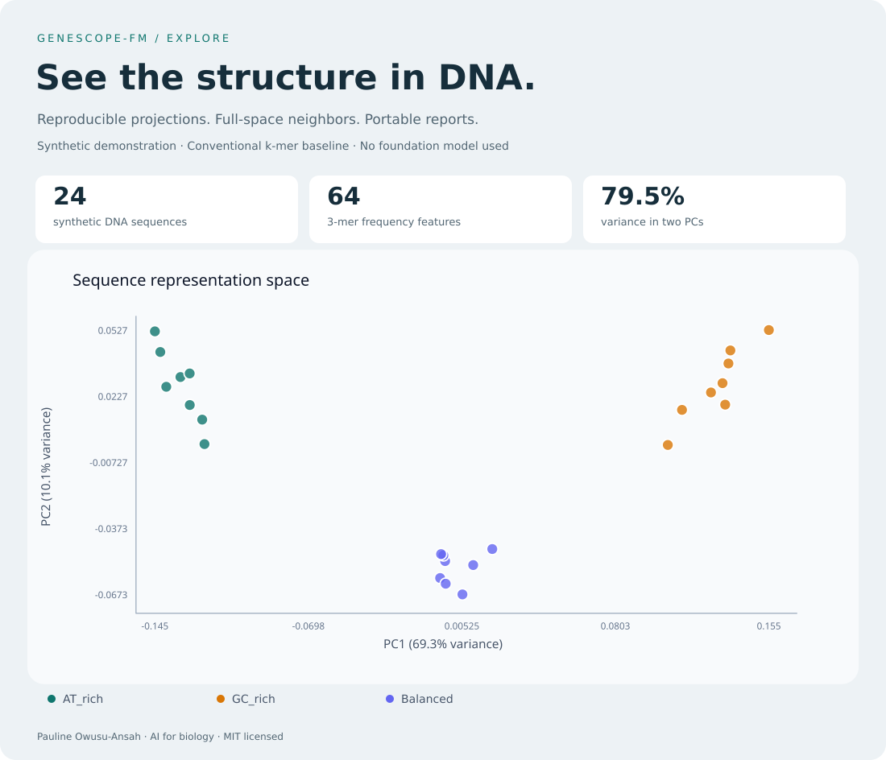

# GeneScope-FM

> **See what foundation models see in DNA.**

[](https://github.com/codewithPauline/GeneScope-FM/actions/workflows/ci.yml?query=branch%3Amain+event%3Apush)
[](LICENSE)


**GeneScope-FM is an open-source AI-for-biology framework for inspecting how genomic
foundation models represent DNA.** It turns sequence embeddings into reproducible
maps, similarity comparisons, and nearest-neighbor analyses—so researchers can
investigate what a representation captures before building predictions on top of it.

The central question: **what biological information is encoded inside a genomic
foundation model's representation of DNA?**

The current **v0.2.1 milestone** combines embedding exploration with a pinned
Nucleotide Transformer adapter, explicit sequence handling, and generation provenance.
Supervised prediction, attribution, and multi-model benchmarking remain in development.



*Analysis preview from 24 synthetic DNA sequences using conventional 3-mer frequencies.
The deliberately different nucleotide compositions illustrate the workflow;
this is not a foundation-model result or a biological benchmark.*

## Try it in minutes

```bash
git clone https://github.com/codewithPauline/GeneScope-FM.git
cd GeneScope-FM
pip install -e .

genescope baseline examples/synthetic/sequences.fasta \
  --k 3 --output kmer_embeddings.csv

genescope explore kmer_embeddings.csv \
  --metadata examples/synthetic/labels.csv \
  --neighbors 3 --output my_report \
  --description "Synthetic DNA; conventional 3-mer baseline; no foundation model used."
```

Open **`my_report/report.html`** in a browser. No GPU, model download, or server is
needed for this demonstration. Hover over points to see their IDs and coordinates.

Committed [example outputs](docs/demo/) include the report, input vectors, projection,
neighbor table, similarity matrix, and reproducibility summary. To view the HTML
from GitHub, download the repository and open it locally. See the
[exploration guide](docs/exploration.md) for input requirements and analysis choices.

## What works today

| Capability | Current implementation |
| --- | --- |
| Validate DNA | FASTA ingestion; A/C/G/T/N validation; unique sequence IDs |
| Analyze embeddings | Strict CSV loading with string IDs preserved |
| Explore structure | Centered PCA; optional seeded UMAP |
| Compare sequences | Cosine similarity and non-self nearest neighbors in the original dimensions |
| Check representations | Numerical rank, constant features, duplicate vectors, zero-vector diagnostics |
| Reproduce analyses | Input hashes, parameters, dependency versions, and exported tables |
| Share results | Standalone HTML report with SVG plot and tooltips |
| Establish a baseline | Normalized, overlapping, strand-specific k-mer frequencies |
| Generate FM embeddings | Dedicated, revision-pinned Nucleotide Transformer v2 50M adapter with CPU integration checks |

The exploration engine accepts embeddings from any source that follows the CSV
schema. Metadata labels color the visualization; they never influence the fit.
Neighbors are calculated from the full representation, independently of the plot.

## Optional UMAP

```bash
pip install -e ".[explore]"
genescope explore kmer_embeddings.csv \
  --metadata examples/synthetic/labels.csv \
  --method umap --umap-neighbors 8 --seed 42 --output umap_report
```

UMAP uses an explicit random seed and one worker. The report records its parameters
and version. Reproducibility across different software versions is not guaranteed.
PCA results are also exported for comparison.

## Foundation-model inference

```bash
pip install torch==2.6.0 --index-url https://download.pytorch.org/whl/cpu
pip install -e ".[ai]"
genescope models
genescope inspect examples/sequences.fasta
```

The dedicated adapter loads
`InstaDeepAI/nucleotide-transformer-v2-50m-multi-species` at an immutable revision
and averages final-layer sequence tokens, excluding padding and special tokens:

```bash
genescope embed examples/sequences.fasta \
  --model nucleotide-transformer --allow-remote-code --device cpu \
  --output embeddings.csv
genescope explore embeddings.csv --output model_report
```

The checkpoint requires custom model code, enabled explicitly by `--allow-remote-code`.
The default limit is 1,000 tokens including CLS. Longer sequences raise an error;
truncation requires `--length-policy truncate` and is recorded per sequence.

Each export includes a `.csv.provenance.json` sidecar linking the exact CSV to its
model revision, pooling, sequence handling, and software versions. The explorer
verifies that link before including provenance in the report.

See the [inference guide and validation evidence](docs/inference.md) for the pinned
revision, CPU compatibility environment, reproducible integration check, and
checkpoint license. Integration checks establish that inference works; biological
prediction accuracy still requires a separate benchmark.

## Python API

```python
from genescope.embeddings import load_embeddings
from genescope.explore import project_pca, nearest_neighbors
from genescope.report import explore_embeddings

frame = load_embeddings("kmer_embeddings.csv")
matrix = frame.filter(regex=r"^embedding_\d+$").to_numpy()

pca = project_pca(matrix)
neighbors = nearest_neighbors(matrix, frame.sequence_id.tolist(), k=3)
report = explore_embeddings("kmer_embeddings.csv", "python_report", neighbors=3)
```

## Scientific scope

GeneScope is organism-independent. Its long-term purpose is to test representations
from human, plant, microbial, and other nucleotide sequences through a consistent
analysis interface.

One planned case study asks whether genomic foundation-model embeddings capture
**evolutionary signal**, assessed against conventional genetic or evolutionary
distances and appropriate controls. This direction complements the general framework.

An attractive projection is not validation. GC content, sequence length, repeats,
shared ancestry, or leakage may explain visible structure. Cosine similarity is
neither evolutionary distance nor evidence of shared function. The exploration
command fits the supplied dataset for visualization; predictive evaluation will
require separate training and held-out data.

Current dense reports support up to 5,000 sequences and have quadratic similarity
cost. Numerical diagnostics describe the representation; they do not establish
biological accuracy. Details are in the [methods and limitations guide](docs/exploration.md).

## Roadmap

| Stage | Status and scope |
| --- | --- |
| v0.1 · Foundation | FASTA reader, Python API, CLI, registry, experimental HF adapter, CSV export |
| v0.2 · Explore | PCA, optional UMAP, similarities, neighbors, diagnostics, reports, offline baseline |
| v0.2.1 · Inference | Pinned checkpoint, CPU integration checks, explicit truncation, special-token pooling, content-linked provenance |
| Next · Biological evaluation | A labeled public dataset, sequence-aware splits, and comparisons against k-mer features |
| v0.3 · Predict | Leakage-aware data splits, downstream classifiers, k-mer comparisons, calibration |
| v0.4 · Explain | Sequence attribution and perturbation analysis with model-specific validation |
| v0.5 · Compare | Multi-model benchmarks, runtime and memory measurements, standardized reports |

See [CHANGELOG.md](CHANGELOG.md) for implemented changes. The k-mer baseline was
brought forward to make exploration runnable and establish a future comparison.

## Development

```bash
pip install -e ".[dev,explore]"
ruff check genescope tests examples
ruff format --check genescope tests examples
pytest
```

CI runs the core suite on Python 3.10, 3.11, and 3.12, exercises the offline workflow,
builds a wheel, and tests optional UMAP and local torch/Transformers inference in separate jobs. Numerical
tests cover known PCA and cosine results, metadata alignment, malformed inputs,
neighbor ties, reproducibility, and report handling. Model weights are not downloaded
by routine CI. The manual foundation-model smoke workflow downloads the actual
pinned checkpoint and exports its validation results.

## Author and license

**Pauline Owusu-Ansah**  
Ph.D. researcher in computational and evolutionary biology.

Released under the [MIT License](LICENSE).
