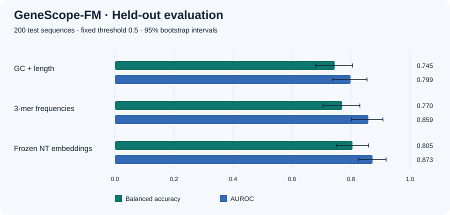

# Binary representation benchmarking

GeneScope compares frozen embeddings with two conventional controls using the
same sequences, splits, scaling rule, classifier, and validation search. The first
worked example is a **small human non-TATA promoter pilot**, not a leaderboard result.

## First measured result

The [committed pilot outputs](benchmarks/promoter-pilot/) use 600 training, 200
validation, and 200 test sequences. Each split contains equal numbers of negative
and positive examples. All sequences are 251 bases long.

| Representation | Features | Balanced accuracy (95% interval) | AUROC (95% interval) | Average precision | Brier score ↓ |
| --- | ---: | --- | --- | ---: | ---: |
| GC fraction + length | 2 | 0.745 (0.680–0.805) | 0.799 (0.737–0.854) | 0.828 | 0.194 |
| 3-mer frequencies | 64 | 0.770 (0.705–0.830) | 0.859 (0.802–0.908) | 0.886 | 0.150 |
| Frozen NT v2 50M | 512 | 0.805 (0.750–0.860) | 0.873 (0.825–0.919) | 0.880 | 0.143 |



The NT minus 3-mer difference is **+0.035 balanced accuracy**, with a paired 95%
interval of **−0.030 to +0.100**, and **+0.0144 AUROC**, with an interval of
**−0.0286 to +0.0656**. Both include zero. This pilot does not establish a reliable
advantage for the foundation model; 3-mers also have slightly higher average
precision here. GC alone already carries substantial signal. Length is constant,
so the GC/length control effectively evaluates GC in this dataset.

## Reproduce the pilot

From the repository root:

```bash
pip install torch==2.6.0 --index-url https://download.pytorch.org/whl/cpu
pip install -e ".[ai,benchmark]"

python examples/prepare_promoter_benchmark.py --output promoter_pilot

OMP_NUM_THREADS=2 MKL_NUM_THREADS=2 genescope embed promoter_pilot/sequences.fasta \
  --model nucleotide-transformer --allow-remote-code --device cpu --batch-size 16 \
  --output promoter_pilot/nt_embeddings.csv

OMP_NUM_THREADS=2 MKL_NUM_THREADS=2 genescope benchmark \
  promoter_pilot/dataset.csv promoter_pilot/nt_embeddings.csv \
  --output promoter_pilot/evaluation \
  --description "Human non-TATA promoter pilot; 600 train / 200 validation / 200 test, balanced by class; filtered subset, not the full published benchmark."
```

Open `promoter_pilot/evaluation/report.html`. Existing output directories are
protected; choose a fresh directory to run again. The model download is about
224 MB. After caching it, `embed --local-files-only` permits offline inference.
The data preparer checks cached files against fixed SHA-256 hashes on every run.

The committed run used Python 3.12.14, NumPy 2.3.5, pandas 2.2.3, scikit-learn 1.8.0,
SciPy 1.17.0, PyTorch 2.6.0+cpu, and Transformers 4.48.3. The model and its custom
code are pinned to `81b29e5786726d891dbf929404ef20adca5b36f1`. All 1,000 sequences
were embedded without truncation. Scores can vary slightly across numerical
libraries and hardware; the data selection is determined by hashes rather than
library-specific random sampling.

## Dataset provenance and overlap screening

Source: [Genomic Benchmarks](https://github.com/ML-Bioinfo-CEITEC/genomic_benchmarks),
by Grešová et al., *Genomic benchmarks: a collection of datasets for genomic
sequence classification*, BMC Genomic Data 24, 25 (2023). The
[author-published Hugging Face dataset](https://huggingface.co/datasets/katarinagresova/Genomic_Benchmarks_human_nontata_promoters/tree/e0003669df0a180c8570ebe091ed91f20fa080ec)
is pinned to `e0003669df0a180c8570ebe091ed91f20fa080ec`, including the original
27,097 training and 9,034 test rows. Label 0 is negative; label 1 is positive.

Before any model fitting or scoring:

1. Identify sequences by their partition and zero-based row index in the pinned
   Parquet file. Order candidates by SHA-256 of `42:sequence_id`.
2. Screen the **entire original training partition** against **all original test
   sequences**, excluding exact full-sequence matches or shared exact 50-base
   windows on either strand. N-containing windows are not counted as matches.
3. This removes **11,872 original training rows**, leaving 15,225 eligible rows.
   Shared windows can reflect repeats or partial overlaps; this count does not
   mean that all removed rows are identical sequences or the same locus.
4. Select 100 examples of each class from the original test partition. Select
   100 per class for validation from eligible original training rows, followed by
   300 per class for training. Validation windows exclude matching training
   candidates; 232 additional candidates were skipped during that selection.
5. Require canonical full sequences to be unique throughout the pilot. Recheck
   the final sample for cross-split exact windows. All three split pairs have zero.

Class quotas and the 50-base rule were fixed before examining classifier results.
Test sequences participate only in this overlap exclusion and test sampling, not
feature scaling, classifier fitting, or hyperparameter selection. This exclusion
policy changes the training distribution. **These scores are not directly
comparable with published results on the unfiltered, full benchmark.**

The HF export has no chromosome or locus fields. Exact-window screening does not
exclude approximate homology, all interval overlap, or shared evolutionary origin.
The checkpoint may have encountered these genomes during pretraining. A larger
evaluation with recovered locus metadata and chromosome/homology groups is the
next scientific validation step. The [grouped workflow](grouped-evaluation.md) now
supports supplied assignments; no such biological result has been measured yet.

The pinned HF card does not declare a dataset license. The upstream code has an
Apache-2.0 license, which does not establish a separate dataset license. Raw DNA
and embeddings are downloaded/generated locally and are not bundled here. NT
weights have their own CC-BY-NC-SA-4.0 license; see the [inference guide](inference.md).

## Evaluation protocol

- Frozen representations: GC fraction among A/C/G/T bases plus length; normalized,
  strand-specific overlapping 3-mers; or final-layer NT mean-pooled embeddings.
- Separate `StandardScaler` and L2 logistic regression for each representation.
  Both are fitted **only on training rows**. The solver is `lbfgs`, with 2,000
  maximum iterations and tolerance `1e-6`; failed convergence aborts the benchmark.
- Select `C` from `0.01, 0.1, 1, 10` by validation AUROC, preferring smaller C on
  an exact tie. Retain that training fit; there is no train-plus-validation refit.
  All three representations selected `C=0.01` in the committed pilot.
- Evaluate held-out test probabilities with a fixed decision threshold of 0.5.
  Export balanced accuracy, AUROC, average precision, F1, MCC, Brier score, log
  loss, and the confusion matrix (rows: true 0/1; columns: predicted 0/1).
- Draw 1,000 class-stratified bootstrap samples with seed 42, sharing sampled test
  indices across representations. Export percentile 95% intervals and paired
  NT-minus-3-mer differences for balanced accuracy and AUROC.

For this ungrouped pilot, intervals assume independent test sequences, condition on the fitted classifiers
and class counts, and exclude variation from training, split selection, and model
pretraining. Balanced sampling does not represent natural promoter prevalence;
precision and probability metrics apply to this constructed test set. No
probability calibration is fitted. Larger samples, multiple prespecified split
seeds, and grouped evaluation are needed before drawing broader conclusions.

## Use your own binary dataset

Supply a CSV with exactly these columns and optional `group`:

| Column | Requirement |
| --- | --- |
| `sequence_id` | Unique nonempty string, matching the embedding export |
| `sequence` | DNA using A/C/G/T/N; whitespace and case are normalized |
| `label` | Exactly `0` or `1`; `1` is the positive class |
| `split` | `train`, `validation`, or `test`; each needs at least two rows per class |
| `group` (optional) | Nonempty locus/chromosome/homology group; disjoint across splits |

Choose biologically defensible groups/splits before benchmarking. Export vectors
with `genescope embed` from the corresponding FASTA, then run `genescope benchmark`.
The evaluator checks exact DNA hashes in the embedding sidecar and joins by ID;
file row order need not match. Old exports without `input_sequences` provenance
must be re-exported. These hashes detect inconsistent files, not fabricated
provenance or a model trained on test labels.

Exact or reverse-complement duplicate sequences are rejected even within a split.
Shared exact 50-base windows or shared supplied groups across splits are rejected.
Sequences shorter than 50 bases, or without eligible A/C/G/T windows, are counted
in the audit because the window screen cannot check them.

Outputs are `report.html`, `metrics.svg`, `results.json`, `predictions.csv`,
`split_manifest.csv`, and `embedding_provenance.json`. The data preparation script
also supplies `source_manifest.json`; the committed pilot includes that file.
Regression tests exercise overlap rejection, hash mismatches, row alignment,
test-set isolation, known metrics, deterministic selection, and output protection.
Routine CI uses small local fixtures and downloads no biological data or weights.


## Grouped evaluations in v0.3.1

When `group` is present, uncertainty automatically uses paired **whole-group**
resampling instead of the sequence bootstrap. Test data must contain at least two
groups supporting each class. Existing grouped datasets with insufficient support
now fail explicitly. The group source is recorded through `genescope split-groups`;
the [grouped evaluation guide](grouped-evaluation.md) explains preparation, per-group
diagnostics, and the limits of few-group uncertainty. A supplied group name alone
is not evidence of chromosome or approximate-homology separation.

New benchmark reports use results schema version 2, add group counts and bootstrap
unit/diagnostics, and include verified split provenance when the adjacent
`split_provenance.json` exists. Grouped reports also export `group_metrics.csv` and
include groups in `predictions.csv`. The committed v0.3 promoter results retain their
original schema and scores.
